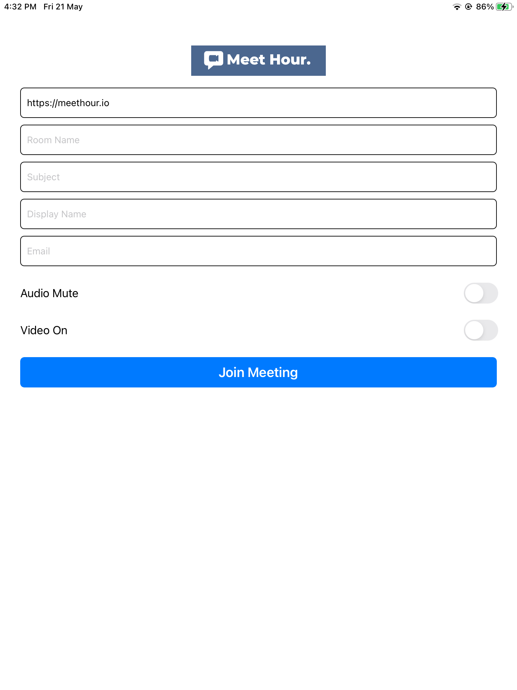

# Meet Hour iOS SDK releases

# MeetHour SDK Implementation - Steps

1. SDK Example Link - https://github.com/v-empower/MeetHour-Web-MobileSDKs
2. API Documentation Link - https://docs.v-empower.com/docs/MeetHour-API/

# Steps to Integrate:

1. Signup for Meet Hour (https://meethour.io) and signup for Developer or Higher plan. Currently we offer 28 days free trial.
2. Once you signup for developer plan, and go to our Dashboard - (https://portal.meethour.io) and tap on "Developers" menu.
3. Now copy and Client ID & Client Secret and keep it handy with you.
4. Go to our API documentation and hit Login API to get oAuth Access Token - (https://bit.ly/3E2hKU7)
5. Once you get an access token, you can access any our API. Now you first thing you have to do is create a contact in our system as soon as user signup in your platform using this API (https://bit.ly/3LRehug). This will give you unique contact_id of that user. You require this id when you schedule a meeting below.
6. Later go to Schedule Meeting API -> Pass all the parameters needed to generate a new meetings - (https://bit.ly/3riFLkx)
7. Once the meeting is genereate, in order to join a meeting you require to Generate JWT Token using this API (https://bit.ly/3ur5pFR) and pass it to the conference URL via MT Parameter - https://meethour.io?mt=eyJ0eXAiOiJKV1QiLCJhbGciOiJIUzI1NiIsImFjY2Vzc190b2tlbiI6ImV5SjBlWEFpT2lKS1YxUWlMQ0poYkdjaU9pSlNVekkxTmlKOS5leUpoZFdRaU9pSTVNemxrWmpVeE5pMDJNekEzTFRRNVkyUXRPVGMxTXkwek1XRTNNemRrT1RGaE1HWWlMQ0pxZEdraU9pSmtNMlUyT

---
id: dev-guide-ios-sdk
title: Meet Hour iOS SDK
---

## For iOS - Pod Update

Always run below command if you want to get latest MeetHourSDK Pod file.

```
pod update MeetHourSDK
pod update MeetHourSDK or pod install --repo-update
```

```
For Apple M1 Silicon Chip
arch -x86_64 pod update MeetHourSDK or arch -x86_64 pod install --repo-update
```

## Latest Verion - 4.2.6

This repository contains the binaries for the **[Meet Hour]() iOS SDK**. Each
release is tagged in this repository and is composed of 2 frameworks:

- MeetHourSDK.xcframework
- WebRTC.xcframework

It is **strongly advised** to use the provided WebRTC framework and not
replace it with any other build, since the provided one is known to work
with the SDK.

## Screenshot


## Using the SDK

The recommended way for using the SDK is by using [CocoaPods](https://cocoapods.org/pods/MeetHourSDK). In order to
do so, add the `MeetHourSDK` dependency to your existing `Podfile` or create
a new one following this example:

```
platform :ios, '12.1'

target 'MeetHourSDKTest' do
    pod 'MeetHourSDK', '~> 4.2.4'

    post_install do |installer|
        installer.pods_project.targets.each do |target|
            target.build_configurations.each do |config|
                config.build_settings['ENABLE_BITCODE'] = 'NO'
            end
        end
    end
end
```

Replace `MeetHourSDKTest` with your project and target names.

Bitcode is not supported, so turn it off for your project.

The SDK uses Swift code, so make sure you select `Always Embed Swift Standard Libraries`
in your project.

Since the SDK requests camera and microphone access, make sure to include the
required entries for `NSCameraUsageDescription` and `NSMicrophoneUsageDescription`
in your `Info.plist` file.

In order for app to properly work in the background, select the "audio" and "voip"
background modes.

Last, since the SDK shows and hides the status bar based on the conference state,
you may want to set `UIViewControllerBasedStatusBarAppearance` to `NO` in your
`Info.plist` file.


# POD INSTALL
```
pod install
```

## API

The API is documented [here](API.md).

## Issues

Please report all issues related to this SDK to the [Meet Hour]() repository.

[CocoaPods]: https://cocoapods.org/pods/MeetHourSDK
[DownloadSDK]: https://github.com/v-empower/MeetHour-MobileSDKs