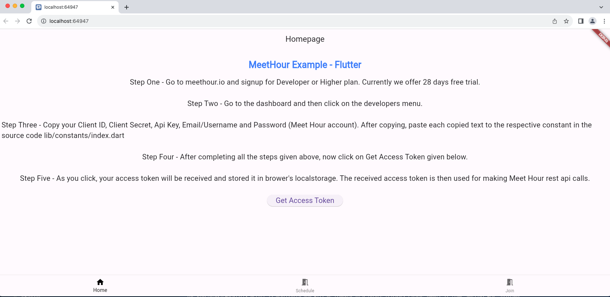

# Meet Hour Flutter Web Example (https://meethour.io)

Meet Hour SDK for Flutter. Supports Web, Android and iOS platforms.

"Meet Hour is HD quality video conference solution with End to End Encrypted and many other features such as lobby mode, Live streaming Connect for fundraising, Video call recording, Youtube Live Stream etc." Please signup for Developer or above plan to use this SDK. Visit https://meethour.io for more details.

### SDK Supports Web, Android & IOS
### Supports WASM Web

```

Example Projects

 - Web - https://github.com/v-empower/MeetHour-Web-MobileSDKs/tree/master/Web/Flutter/MeetHourSDKTest
 - Android & iOS - https://github.com/v-empower/MeetHour-Web-MobileSDKs/tree/master/Mobile/Flutter/MeetHourSDKTest

```

Pub dev - https://pub.dev/packages/meet_hour

```
  meet_hour: '>=5.0.38'
```

# MeetHour SDK Implementation - Subscribe for Developer or Above Plan.

1. SDK Examples Link - https://github.com/v-empower/MeetHour-Web-MobileSDKs
2. API Documentation Link - https://docs.v-empower.com/docs/MeetHour-API/

### Steps to Use Meet Hour React Flutter SDK Example

1. Go to meethour.io and signup for Developer or Higher plan. Currently we offer 28 days free trial.
2. Go to the dashboard and then click on developers menu.
3. Copy your Client ID, Client Secret and Api Key. After copying, paste each copied text to the respective constant in the source code lib/constants/index.dart
4. On Home page Click on Get Access Token
5. Then Try Schedule a Meeting & Join Meeting.


## Screenshot


## Table of Contents
  - [API End Points Supported](#api)
  - [Configuration](#configuration)
    - [WEB](#web)
    - [IOS](#ios)
      - [Podfile](#podfile)
      - [Info.plist](#infoplist)
    - [Android](#android)
      - [Gradle](#gradle)
      - [AndroidManifest.xml](#androidmanifestxml)
      - [Minimum SDK Version 23](#minimum-sdk-version-23)
      - [Proguard](#proguard)
  - [Join A Meeting](#join-a-meeting)
    - [MeetHourMeetingOptions](#meetHourMeetingoptions)
    - [FeatureFlag](#featureflag)
    - [MeetHourMeetingResponse](#meetHourMeetingresponse)
  - [Listening to Meeting Events](#listening-to-meeting-events)
    - [Per Meeting Events](#per-meeting-events)
    - [Global Meeting Events](#global-meeting-events)
  - [Closing a Meeting Programmatically](#closing-a-meeting-programmatically)


<a name="api"></a>

### API End Points Supported

1. To Get Access Token Endpoint : => https://docs.v-empower.com/docs/MeetHour-API/a44a7d7669f91-user-login-get-access-token

   ```
      LoginType LoginObject = LoginType(
        client_id: '',
        client_secret: '',
        grant_type: 'password',
        password: '',
        username: ''
        );

       Map<String, dynamic> response - await ApiServices.login(LoginObject);
   ```

   => You have to pass respective values in the argument section. Hence, to get desired response.

2. To schedule a meeting: => https://docs.v-empower.com/docs/MeetHour-API/2de4b757a6312-meeting-schedule-meeting

   ```
    ScheduleMeetingType ScheduleObject = ScheduleMeetingType(
      meetingName : 'Test',
      agenda: '',
      passcode: '',
      meetingDate: '',
      meetingTime: '',
      meetingMeridiem: '',
      durationhr: '',
      durationmin: '',
      timezone: '',
      isrecurring: '',
      recurringtype: '',
      repeat_interval: '',
      endBy: '',
      enddatetime: '',
      instructions: '',
      is_show_portal: '',
      enablepreregistration: '',
      meetingtopic: '',
      meetingagenda: '',
      options: '',
      attend: '',
      groups: '',
      hostusers: ''
    );

    Map<String, dynamic> response = await ApiServices.scheduleMeeting(token, ScheduleObject);

   ```

3. To Generate JWT Token Endpoint => https://docs.v-empower.com/docs/MeetHour-API/b7e3d0ab3906f-generate-jwt

   ```
      GenerateJwtType JWTObject = GenerateJwtType(
        config: '',
        contactid,
        meetingid,
        uiconfig

      Map<String, dynamic> response =  await ApiServices.generateJwt(token, JWTObject);

      );
   ```

4. To fetch User Details: => https://docs.v-empower.com/docs/MeetHour-API/ff9d0e37d9191-user-details

   ```
       Map<String, dynamic> response =  await ApiServices.userDetails(token);
   ```

5. To fetch access Token using Refresh Token: => https://docs.v-empower.com/docs/MeetHour-API/d851be1af9804-get-access-token-using-refresh-token

   ```
      RefreshTokenType RefreshTokenObject = RefreshTokenType(
               client_id: '';
               client_secret: '';
               grant_type: '';
               refresh_token: '';
      )
      Map<String, dynamic> response =  await ApiServices.getRefreshToken(token, RefreshTokenObject);
   ```

6. To add a contact in Meet Hour database: => https://docs.v-empower.com/docs/MeetHour-API/bd1e416413e8c-add-contact

   ```
       AddContactType AddContactObject = AddContactType(
            countrycode: '',
            email: '',
            firstname: '',
            image: '',
            is_show_portal: '',
            lastname: '',
            phone: ''
       );
      Map<String, dynamic> response =  await ApiServices.addContact(token AddContactObject);
   ```

7. To get Timezones of various countries: => https://docs.v-empower.com/docs/MeetHour-API/c688c29bce9b9-timezone-list

   ```
       Map<String, dynamic> response =  await ApiServices.timezone(token)

   ```

8. To get list of all the contacts in your Meet Hour account: => https://api.meethour.io/api/{version}/customer/contacts

   ```

      ContactsType AddContactObject = ContactsType(
        exclude_hosts: 1100,
        limit: 10,
        page: 1
      );
      
      Map<String, dynamic> response =  await ApiServices.contactsList(token, AddContactObject);

   ```

9. To make changes in the existing contact details: => https://docs.v-empower.com/docs/MeetHour-API/28cae9187d215-edit-contact

   ```

    EditContactType EditContactObject =  EditContactType(
      contactid: 1150;
      countrycode: '',
      email: '',
      firstname: '',
      image: '',
      is_show_portal: '',
      lastname: '',
      phone: ''
    );

  Map<String, dynamic> response = ApiServices.editContact(token, EditContactObject);

   ```

10. To get Upcoming Meetings: => https://docs.v-empower.com/docs/MeetHour-API/31df88388416d-upcoming-meetings

   ```
    UpcomingMeetingType UpcomingMeetingObject =  UpcomingMeetingType(
      page: 10,
      limit: 10,
      show_all: 1
    );
    
     Map<String, dynamic> response = ApiServices.upcomingMeetings(token, UpcomingMeetingObject

  ```

11. To archive a meeting: => https://docs.v-empower.com/docs/MeetHour-API/1dd64523cc6bf-archive-meeting

    ```
    ArchiveMeetingType ArchiveMeetingObject =  ArchiveMeetingType(
      id: 10
    );
    
     Map<String, dynamic> response = ApiServices.archiveMeeting(token, ArchiveMeetingObject);

    ```

12. To get the details of a missed meeting: => https://docs.v-empower.com/docs/MeetHour-API/92998e2dda102-missed-meetings

    ```
    MissedMeetingType MissedMeetingObject =  MissedMeetingType(
      limit: 10,
      page: number,
      show_all: 1
    );
    
     Map<String, dynamic> response = ApiServices.missedMeetings(token, MissedMeetingObject);
    ```

13. To get completed meetings: => https://docs.v-empower.com/docs/MeetHour-API/aa9ef6a678250-completed-meetings

    ```
    CompletedMeetingType CompletedMeetingObject =  CompletedMeetingType(
      limit: 10,
      page: number,
      show_all: 1
    );
    
     Map<String, dynamic> response = ApiServices.completedMeetings(token, CompletedMeetingObject);
    ```

14. To edit an existing meeting: => https://docs.v-empower.com/docs/MeetHour-API/5dedde36380b4-meeting-edit-meeting

    ```

    EditMeetingType EdiMeetingObject = EditMeetingType(
      meeting_id: ''
      meetingName : 'Test',
      agenda: '',
      passcode: '',
      meetingDate: '',
      meetingTime: '',
      meetingMeridiem: '',
      durationhr: '',
      durationmin: '',
      timezone: '',
      isrecurring: '',
      recurringtype: '',
      repeat_interval: '',
      endBy: '',
      enddatetime: '',
      instructions: '',
      is_show_portal: '',
      enablepreregistration: '',
      meetingtopic: '',
      meetingagenda: '',
      old_attend: []
      options: '',
      attend: '',
      groups: '',
      hostusers: ''
    );
    Map<String, dynamic> response = await ApiServices.editMeeting(token, EdiMeetingObject);


    ```

15. To view a meeting: => https://docs.v-empower.com/docs/MeetHour-API/7e9a0a1e0da7f-meeting-view-meeting

    ```

    ViewMeetingType ViewMeetingObject =  ViewMeetingType(
      meeting_id: ''
    );
    
     Map<String, dynamic> response = ApiServices.viewMeeting(token, ViewMeetingObject);
    ```

16. To get all the recordings list: => https://docs.v-empower.com/docs/MeetHour-API/ce7c4fd8cae7e-recording-list

    ```
    RecordingsListType RecordingMeetingObject =  RecordingsListType(
      filter_by: '';
      limit: '';
      page: '';
    );
    
     Map<String, dynamic> response = ApiServices.recordingsList(token, RecordingMeetingObject);
  ````


### Configuration for Web
<a name="configuration-web"></a>
### Web

The plugin allows you to insert Meet Hour meeting in a flutter web project. 
* Set the meeting view as a child for a flutter component allowing sizing the meeting section with `onload` callback
* Set listeners to meeting events
* Send commands to meetting

To implement you need to include Meet Hour External API by passing API Keys available on this link - https://portal.meethour.io/customer/developers 
```javascript
<script src="https://api.meethour.io/libs/v2.4.6/external_api.min.js?apiKey=${API_KEY}" type="application/javascript"></script>
```

Example:
```html
<body>
  <script>
    if ('serviceWorker' in navigator) {
      window.addEventListener('load', function () {
        navigator.serviceWorker.register('/flutter_service_worker.js');
      });
    }
  </script>
  <script src="https://api.meethour.io/libs/v2.4.6/external_api.min.js?apiKey=${API_KEY}" type="application/javascript"></script>
  <script src="main.dart.js" type="application/javascript"></script>
</body>
</html>
```


### Configuration for Android & iOS

<a name="configuration"></a>
## Configuration

<a name="ios"></a>
### IOS
* Note: Example compilable with XCode 12.2 & Flutter 1.22.4.

#### Podfile
Ensure in your Podfile you have an entry like below declaring platform of 11.0 or above and disable BITCODE.
```
platform :ios, '12.1'

...

post_install do |installer|
  installer.pods_project.targets.each do |target|
  flutter_additional_ios_build_settings(target)
      target.build_configurations.each do |config|
        config.build_settings['ENABLE_BITCODE'] = 'NO'
        config.build_settings["EXCLUDED_ARCHS[sdk=iphonesimulator*]"] = "arm64"
         end
     end
   end
```

#### Info.plist
Add NSCameraUsageDescription and NSMicrophoneUsageDescription to your
Info.plist.

```text
<key>NSCameraUsageDescription</key>
<string>$(PRODUCT_NAME) MyApp needs access to your camera for meetings.</string>
<key>NSMicrophoneUsageDescription</key>
<string>$(PRODUCT_NAME) MyApp needs access to your microphone for meetings.</string>
```

<a name="android"></a>
### Android

#### Gradle
Set dependencies of build tools gradle to minimum 3.6.3:
```gradle
dependencies {
    classpath 'com.android.tools.build:gradle:7.1.0' <!-- Upgrade this -->
    classpath "org.jetbrains.kotlin:kotlin-gradle-plugin:$kotlin_version"
}
```

Set distribution gradle wrapper to minimum 5.6.4.
```gradle
distributionBase=GRADLE_USER_HOME
distributionPath=wrapper/dists
zipStoreBase=GRADLE_USER_HOME
zipStorePath=wrapper/dists
distributionUrl=https\://services.gradle.org/distributions/gradle-7.2-bin.zip <!-- Upgrade this -->
```

#### AndroidManifest.xml
Meet Hour's SDK AndroidManifest.xml will conflict with your project, namely 
the application:label field. To counter that, go into 
`android/app/src/main/AndroidManifest.xml` and add the tools library
and `tools:replace="android:label"` to the application tag.

```xml
<manifest xmlns:android="http://schemas.android.com/apk/res/android"
    package="yourpackage.com"
    xmlns:tools="http://schemas.android.com/tools"> <!-- Add this -->
    <application 
        tools:replace="android:label"  
        android:name="your.application.name"
        android:label="My Application"
        android:icon="@mipmap/ic_launcher">
        ...
    </application>
...
</manifest>
```

#### Minimum SDK Version 23
Update your minimum sdk version to 23 in android/app/build.gradle
```groovy
defaultConfig {
    applicationId "go.meethour.io.flutter.sdk_example"
    minSdkVersion 23 //Required for MeetHour
    targetSdkVersion 33
    versionCode flutterVersionCode.toInteger()
    versionName flutterVersionName
}
```

<a name="join-a-meeting"></a>

## Join A Meeting

```dart
_joinMeeting() async {
    try {
	  FeatureFlag featureFlag = FeatureFlag();
	  featureFlag.welcomePageEnabled = false;
	  featureFlag.resolution = FeatureFlagVideoResolution.MD_RESOLUTION; // Limit video resolution to 360p
	  
      var options = MeetHourMeetingOptions()
      ..webOptions = {
        "roomName": "MEETINGID", // roomName is the Meeting ID
        "width": "100%", // Width of the Conference frame
        "height": "100%", // Height of the Conference frame

        // Add "userInfo" option to auto-fill the user details in conference especially when no jwt token is passed.
        // When JWT is passed, no need to provide userInfo as user details are taken from JWT under the hood.

        // "userInfo": {
        // "email": "user@example.com",
        // "displayName": "John Doe"
        // },
        "serverURL": "https://meethour.io",
        "enableWelcomePage": false,
        "chromeExtensionBanner": null,
        "jwt": "", // Pass the JWT Token that you receive from Generate JWT API
        "apikey": "",
        "pcode": "", // When pCode is passed, participant will be joined without asking password.
        "configOverwrite": { // If you want to reflect the changes from the dashboard, remove configOverwrite from here.
                "prejoinPageEnabled": true, // Make this false to skip the prejoin page 
                "disableInviteFunctions": true,
                "disableProfile": true,
                "disableEmail": false // make this `true` to disable Email on Prejoin page.
            },
        "interfaceConfigOverwrite": { // If you want to reflect the changes from the dashboard, remove interfaceConfigOverwrite from here.
            "applyMeetingSettings": true, // This is managed from this page - https://portal.meethour.io/customer/ui_settings
            "disablePrejoinHeader": true,
            "disablePrejoinFooter": true,                
            "SHOW_MEET_HOUR_WATERMARK": false,
            "ENABLE_DESKTOP_DEEPLINK": false,
            "HIDE_DEEP_LINKING_LOGO": true,
            "MOBILE_APP_PROMO": false,
            "ENABLE_MOBILE_BROWSER": true,
            "DISABLE_VOICE_COMMAND": true,
            "CHANGE_MODERATOR_NAME": 'Moderator'
            },
      }

      await MeetHour.joinMeeting(options);
    } catch (error) {
      debugPrint("error: $error");
    }
  }
```

<a name="meetHourMeetingoptions"></a>

### MeetHourMeetingOptions

| Field             | Required  | Default           | Description |
 ------------------ | --------- | ----------------- | ----------- |
| room              | Yes       | N/A               | Unique room name that will be appended to serverURL. Valid characters: alphanumeric, dashes, and underscores. |
| subject           | No        | $room             | Meeting name displayed at the top of the meeting.  If null, defaults to room name where dashes and underscores are replaced with spaces and first characters are capitalized. |
| userDisplayName   | No        | "Guest"  | User's display name. |
| userEmail         | No        | none              | User's email address. |
| audioOnly         | No        | false             | Start meeting without video. Can be turned on in meeting. |
| audioMuted        | No        | false             | Start meeting with audio muted. Can be turned on in meeting. |
| videoMuted        | No        | false             | Start meeting with video muted. Can be turned on in meeting. |
| serverURL         | No        | meethour.io     | Specify your own hosted server. Must be a valid absolute URL of the format `<scheme>://<host>[/path]`, i.e. https://someHost.com. Defaults to Meet Hour's servers. |
| userAvatarURL     | N/A       | none              | User's avatar URL. |
| token             | N/A       | none              | JWT token used for authentication. |
| pcode             | N/A       | none              | pcode used for passing meeting password dynamically. |
| prejoinPageEnabled             | N/A       | false              | Make it false to Skip PrejoinPage. |
| disableInviteFunctions             | N/A       | false              | To disable invite functions in Mobile SDK. |
| featureFlag      | No        | see below         | Object of FeatureFlag class used to enable/disable features and set video resolution of Meet Hour SDK. |
| webOptions       | N/A        - Follow the instructions from Generic Javascript object from this URL - https://github.com/v-empower/MeetHour-Web-MobileSDKs/tree/master/Web/Javascript/Generic-Javascript


<a name="meetHourMeetingresponse"></a>

### FeatureFlag

Feature flag allows you to limit video resolution and enable/disable few features of Meet Hour SDK mentioned in the list below.  
If you don't provide any flag to MeetHourMeetingOptions, default values will be used.  

| Flag | Default (Android) | Default (iOS) | Description |
| ------------------------------ | ----- | ----- | ----------- |
| `addPeopleEnabled`          | true  | true  | Enable the blue button "Add people", show up when you are alone in a call. Required for flag `inviteEnabled` to work. |
| `calendarEnabled`            | true  | auto  | Enable calendar integration. |
| `callIntegrationEnabled`    | true  | true  | Enable call integration (CallKit on iOS, ConnectionService on Android). **SEE REMARK BELOW** |
| `closeCaptionsEnabled`      | true  | true  | Enable close captions (subtitles) option in menu. |
| `conferenceTimerEnabled`                | true  | true  | Enable conference timer. |
| `chatEnabled`                | true  | true  | Enable chat (button and feature). |
| `inviteEnabled`              | true  | true  | Enable invite option in menu. |
| `iOSRecordingEnabled`       | N/A   | false | Enable recording in iOS. |
| `kickOutEnabled`       | true   | true | Enable kick-out option in video thumb of participants. |
| `liveStreamingEnabled`      | auto  | auto  | Enable live-streaming option in menu. |
| `meetingNameEnabled`        | true  | true  | Display meeting name. |
| `meetingPasswordEnabled`    | true  | true  | Display meeting password option in menu (if a meeting has a password set, the dialog will still show up). |
| `pipEnabled`                 | auto  | auto  | Enable Picture-in-Picture mode. |
| `raiseHandEnabled`          | true  | true  | Enable raise hand option in menu. |
| `recordingEnabled`           | auto  | N/A   | Enable recording option in menu. |
| `resoulution`           | N/A  | N/A  | Set local and (maximum) remote video resolution. Overrides server configuration. Accepted values are: LD_RESOLUTION for 180p, MD_RESOLUTION for 360p, SD_RESOLUTION for 480p(SD), HD_RESOLUTION for 720p(HD) . |
| `serverURLChangeEnabled`           | true  | true  | Enable server URL change. |
| `tileViewEnabled`           | true  | true  | Enable tile view option in menu. |
| `toolboxAlwaysVisible`      | true  | true  | Toolbox (buttons and menus) always visible during call (if not, a single tap displays it). |
| `videoShareButtonEnabled`      | true  | true  | Enable video share button. |
| `welcomePageEnabled`        | false | false | Enable welcome page. "The welcome page lists recent meetings and calendar appointments and it's meant to be used by standalone applications." |

### MeetHourMeetingResponse

| Field           | Type    | Description |
| --------------- | ------- | ----------- |
| isSuccess       | bool    | Success indicator. |
| message         | String  | Success message or error as a String. |
| error           | dynamic | Optional, only exists if isSuccess is false. The error object. |

<a name="listening-to-meeting-events"></a>

## Listening to Meeting Events

Events supported

| Name                   | Description  |
| :--------------------- | :----------- |
| onConferenceWillJoin   | Meeting is loading. |
| onConferenceJoined     | User has joined meeting. |
| onConferenceTerminated | User has exited the conference. |
| onPictureInPictureWillEnter | User entered PIP mode. |
| onPictureInPictureTerminated | User exited PIP mode. |
| onError                | Error has occurred with listening to meeting events. |

### Per Meeting Events
To listen to meeting events per meeting, pass in a MeetHourMeetingListener
in joinMeeting. The listener will automatically be removed when an  
onConferenceTerminated event is fired.

```
await MeetHour.joinMeeting(options,
  listener: MeetHourMeetingListener(onConferenceWillJoin: ({message}) {
    debugPrint("${options.room} will join with message: $message");
  }, onConferenceJoined: ({message}) {
    debugPrint("${options.room} joined with message: $message");
  }, onConferenceTerminated: ({message}) {
    debugPrint("${options.room} terminated with message: $message");
  }, onPictureInPictureWillEnter: ({message}) {
	debugPrint("${options.room} entered PIP mode with message: $message");
  }, onPictureInPictureTerminated: ({message}) {
	debugPrint("${options.room} exited PIP mode with message: $message");
  }));
```

### Global Meeting Events
To listen to global meeting events, simply add a MeetHourListener with  
`MeetHour.addListener(myListener)`. You can remove listeners using  
`MeetHour.removeListener(listener)` or `MeetHour.removeAllListeners()`.

```dart
@override
void initState() {
  super.initState();
  MeetHour.addListener(MeetHourMeetingListener(
    onConferenceWillJoin: _onConferenceWillJoin,
    onConferenceJoined: _onConferenceJoined,
    onConferenceTerminated: _onConferenceTerminated,
    onPictureInPictureWillEnter: _onPictureInPictureWillEnter,
    onPictureInPictureTerminated: _onPictureInPictureTerminated,
    onError: _onError));
}

@override
void dispose() {
  super.dispose();
  MeetHour.removeAllListeners();
}

_onConferenceWillJoin({message}) {
  debugPrint("_onConferenceWillJoin broadcasted");
}

_onConferenceJoined({message}) {
  debugPrint("_onConferenceJoined broadcasted");
}

_onConferenceTerminated({message}) {
  debugPrint("_onConferenceTerminated broadcasted");
}

_onPictureInPictureWillEnter({message}) {
debugPrint("_onPictureInPictureWillEnter broadcasted with message: $message");
}

_onPictureInPictureTerminated({message}) {
debugPrint("_onPictureInPictureTerminated broadcasted with message: $message");
}

_onError(error) {
  debugPrint("_onError broadcasted");
}
```

## Closing a Meeting Programmatically
```dart
MeetHour.closeMeeting();
```

