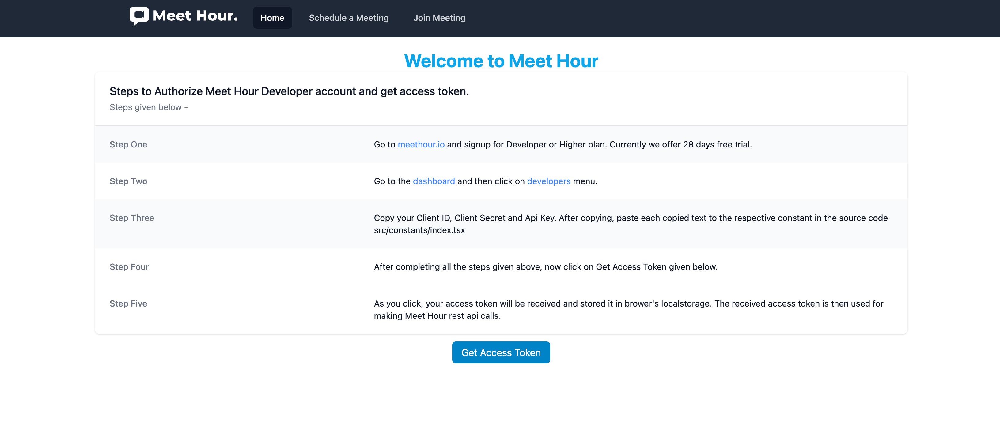

# MeetHour-Java-Example


[Meet Hour - 100% free video conference solution](https://meethour.io)
Meet Hour is 100% free video conference solution with End to End Encrypted and many other features such as lobby mode, Donor box & Click&Pledge Connect for fundraising, Video call recording, Youtube Live Stream etc.

# Features:
✅  Free Unlimited Time Group Video Conference

✅  Upto 100 Participants Group Meeting

✅  Free Video Conference Recording

✅  YouTube Live Stream

✅  Raise funds via Click&Pledge Connect & DonorBox

✅  Virtual Background

✅  Live Pad

✅  Screensharing on Desktop & Mobile and many other features.

# Try out one free session -
    1. Website - https://meethour.io
    2. Android - https://bit.ly/2U239ll
    3. iOS - https://apple.co/3k8Rpbn



# MeetHour API Documentation

    API Documentation Link - https://docs.v-empower.com/docs/MeetHour-API/

## Meet Hour Java Example

```
    https://github.com/v-empower/MeetHour-Web-MobileSDKs/tree/master/Java/Core-Java
```

## Maven Repo

```
    https://repo.meethour.io/maven/releases/go/meethour/io/javasdk/meethour_sdk/
```

## Install

```
  <dependencies>
    <dependency>
      <groupId>go.meethour.io.javasdk</groupId>
      <artifactId>meethour_sdk</artifactId>
      <version>1.0.0</version>
      <scope>test</scope>
    </dependency>
  </dependencies>


    <repositories>
        <repository>
            <id>meethour-repo</id>
            <url>https://repo.meethour.io/maven/releases/</url>
        </repository>
    </repositories>
```

### API Usage
Provide your credentials in the constructor of Login object and hit the login api to get your access token. Which will further be used for making rest of the api calls.
```
<%@ page import="go.meethour.io.javasdk.services.ApiServices"%>
<%@ page import="go.meethour.io.javasdk.types.LoginType"%>
<%@ page import="go.meethour.io.javasdk.types.GenerateJwt" %>
<%@ page import="go.meethour.io.javasdk.types.ViewMeeting" %>
<%@ page import="go.meethour.io.javasdk.types.ScheduleMeetingType" %>
<%@ page import="org.json.JSONObject" %>
<%
 String  CONFERENCE_URL = "meethour.io";
 String GRANT_TYPE = "password";
 String GRANT_REFRESH_TYPE = "refresh_token";
 String BASE_URL = "https://api.meethour.io";
 String API_VERSION = "v1.2";
 String API_RELEASE = "v2.4.6";

 String CLIENT_ID = "";
 String CLIENT_SECRET = "";
 String API_KEY = "";
 String EMAIL = "";
 String PASSWORD = "";
 ApiServices apiServices = new ApiServices();

 LoginType loginDetails = new LoginType(CLIENT_ID,CLIENT_SECRET, GRANT_TYPE,EMAIL, PASSWORD);
 String loginresponse = apiServices.login(loginDetails);

 JSONObject responsesObject = new JSONObject(loginresponse);
 String access_token = responsesObject.getString("access_token");

 String meeting_name = "API Calls";
 String passcode = "123456789";
 String timezone = "Asia/Kolkata";
 String meeting_date = "23-06-2030";
 String meeting_time = "10:00";
 String meeting_meridiem = "PM";
 int send_calendar_invite = 1;
 int is_show_portal = 1;
 String options=null;
 String attend=null;
 String hostusers=null;

ScheduleMeetingType meeting = new ScheduleMeetingType(meeting_name, passcode, meeting_time, meeting_meridiem,meeting_date, timezone, 1, 1,  null,null,null);
String scheduleObject = apiServices.schedulemeeting(meeting, access_token);
JSONObject scheduleresponses = new JSONObject(scheduleObject);

JSONObject data = scheduleresponses.getJSONObject("data");

String meeting_id = data.getString("meeting_id");

String pCode = data.getString("pcode");


ViewMeeting view = new ViewMeeting(meeting_id);
String viewObject = apiServices.viewmeeting(view, access_token);
String viewmeetingResponse=viewObject;

GenerateJwt jwt = new GenerateJwt(meeting_id);
String jwtObject = apiServices.generatejwt(jwt, access_token);
JSONObject jwtresponses = new JSONObject(jwtObject);
String JwtToken = jwtresponses.getString("jwt");


%>


<%@ page language="java" contentType="text/html; charset=UTF-8"
    pageEncoding="UTF-8"%>
<!DOCTYPE html>
<html>
    <head>
        <style>
            html, body {
                height: 100%;
                margin: 0;
                padding: 0;
                overflow: hidden;
            }
            #conference-parent {
                height: 100%;
            }
        </style>
    </head>
<body>
    <script type="text/javascript" src="https://api.meethour.io/libs/<%= API_RELEASE %>/external_api.min.js?apiKey=<%= API_KEY %>"></script>
    <div class="relative" id="conference-parent"></div>
    <script type="text/javascript">
        try {
            const conferencePanel = document.createElement("div");
            conferencePanel.setAttribute("id", "conference");
            conferencePanel.setAttribute("style", "height: 100%;");
            const meetingPanel = document.querySelector("#conference-parent");
            meetingPanel.appendChild(conferencePanel);
            var domain = "<%= CONFERENCE_URL %>";
            var options = {
                roomName: "<%= meeting_id %>",
                parentNode: document.querySelector("#conference"),
                jwt: "<%= JwtToken %>",
                apiKey: "<%= API_KEY %>",
                pcode: "<%= pCode %>",
                interfaceConfigOverwrite: {
                    applyMeetingSettings: true,
                    disablePrejoinHeader: true,
                    disablePrejoinFooter: true,
                    SHOW_MEET_HOUR_WATERMARK: false,
                    ENABLE_DESKTOP_DEEPLINK: false,
                    HIDE_DEEP_LINKING_LOGO: true,
                    MOBILE_APP_PROMO: false,
                    ENABLE_MOBILE_BROWSER: true,
                },
            };
            var api = new MeetHourExternalAPI(domain, options);
        } catch (error) {
            console.log(error);
        }
    </script>
</body>
</html>

```
### API End Points Supported
Important points:
=> Instead of '{version}', you to pass our latest version whenever you call the given functions. Currently we are using v1.2 Same version applies to the below calls.
=> In the token section, you need to pass the received access token which is received when login api is hit, for making further api calls.
=> You can make API calls by passing required properties in the constructor. But, to meet special requirements you can set rest of the properties directly, according to your need. For more details go to https://docs.v-empower.com/docs/MeetHour-API then click on APIS section to get all the information related to each api call.

1. To Get Access Token Endpoint : => https://docs.v-empower.com/docs/MeetHour-API/a44a7d7669f91-user-login-get-access-token
   ```
        import go.meethour.io.javasdk.types.LoginType;
        LoginType loginDetails = new LoginType(CLIENT_ID,CLIENT_SECRET, GRANT_TYPE,EMAIL, PASSWORD); # pass values
        ApiServices apiServices = new ApiServices();
        String login_response = apiServices.login(loginDetails);
        System.out.println(login_response);
   ```
   => You have to pass respective values in the argument section. Hence, to get desired response.
2. To schedule a meeting: => https://docs.v-empower.com/docs/MeetHour-API/2de4b757a6312-meeting-schedule-meeting
   ```
       import go.meethour.io.javasdk.types.ScheduleMeetingType;
        ScheduleMeetingType meeting = new ScheduleMeetingType(meeting_name, passcode, meeting_time, meeting_meridiem,meeting_date, timezone, 1, 1,  null,null,null); #pass value
        ApiServices apiServices = new ApiServices();
        String schedule_meeting_response = apiServices.schedulemeeting(meeting, access_token);
        System.out.println(schedule_meeting_response);
   ```
3. To Generate JWT Token Endpoint => https://docs.v-empower.com/docs/MeetHour-API/b7e3d0ab3906f-generate-jwt
   ```
        import go.meethour.io.javasdk.types.GenerateJwt;
        GenerateJwt jwt = new GenerateJwt(meeting_id); # pass values
        ApiServices apiServices = new ApiServices();
        String schedule_meeting_response = apiServices.schedulemeeting(meeting, access_token);
        String generate_jwt_response = apiServices.generatejwt(jwt, access_token);
        System.out.println(generate_jwt_response);
   ```
4. To fetch User Details: => https://docs.v-empower.com/docs/MeetHour-API/ff9d0e37d9191-user-details
   ```
        import go.meethour.io.javasdk.types.UserDetails;
        UserDetails user = new UserDetails();
        ApiServices apiServices = new ApiServices();
        String user_details_response = apiServices.userdetails(user, access_token);
        System.out.println(user_details_response);
   ```
5. To fetch access Token using Refresh Token: => https://docs.v-empower.com/docs/MeetHour-API/d851be1af9804-get-access-token-using-refresh-token
```
        import go.meethour.io.javasdk.types.RefreshToken;
        ApiServices apiServices = new ApiServices();
        RefreshToken refresh = new RefreshToken(CLIENT_ID,CLIENT_SECRET,refresh_token,access_token); #pass values
        String refresh_token_response = apiServices.refreshtoken(refresh);
        System.out.println(refresh_token_response);
```
6. To add a contact in Meet Hour database: => https://docs.v-empower.com/docs/MeetHour-API/bd1e416413e8c-add-contact
```
        import go.meethour.io.javasdk.types.AddContactType;
        AddContactType contactDetails = new AddContactType(EMAIL,Fristname,lastname,phone,country_code,Image,true); #pass values
        ApiServices apiServices = new ApiServices();
        String add_contact_response = apiServices.addcontact(contactDetails, access_token);
        System.out.println(add_contact_response)
```
7. To get Timezones of various countries: => https://docs.v-empower.com/docs/MeetHour-API/c688c29bce9b9-timezone-list
   ```
        import go.meethour.io.javasdk.types.TimeZone;
        TimeZone time = new TimeZone();
        ApiServices apiServices = new ApiServices();
        String timeZone_response = apiServices.timeZone(time, access_token);
        System.out.println(timeZone_response)
   ```
8. To get list of all the contacts in your Meet Hour account: => https://api.meethour.io/api/{version}/customer/contacts
   ```
        import go.meethour.io.javasdk.types.ContactsType;
        ContactsType contactObjects = new ContactsType(null, null, null);
        ApiServices apiServices = new ApiServices();
        String contacts_response = apiServices.contacts(contactObjects, access_token);
        System.out.println(contacts_response)
   ```
9. To make changes in the existing contact details: => https://docs.v-empower.com/docs/MeetHour-API/28cae9187d215-edit-contact
   ````
        import go.meethour.io.javasdk.types.EditContactType;
        EditContactType contacts = new EditContactType(id,country_code,EMAIL, Firstname,lastname,Image,true,phone) # pass values
        ApiServices apiServices = new ApiServices();
        String edit_contacts_response = apiServices.editcontact(contacts, access_token);
        System.out.println(edit_contacts_response)
   ````
10. To get Upcoming Meetings: => https://docs.v-empower.com/docs/MeetHour-API/31df88388416d-upcoming-meetings
    ```
        import go.meethour.io.javasdk.types.UpcomingMeetings;
        UpcomingMeetings upcomingmeeting = new UpcomingMeetings(null, null, null);
        ApiServices apiServices = new ApiServices();
        String upcoming_meetings_response = apiServices.upcomingmeeting(upcomingmeeting, access_token);
        System.out.println(upcoming_meetings_response)
    ```
11. To archive a meeting: => https://docs.v-empower.com/docs/MeetHour-API/1dd64523cc6bf-archive-meeting
    ```
        import go.meethour.io.javasdk.types.ArchiveMeetings;
        ArchiveMeetings archive = new ArchiveMeetings(id);  # pass values
        ApiServices apiServices = new ApiServices();
        String ArchiveMeeting_response = apiServices.archivemeetings(archive, access_token);
        System.out.println(ArchiveMeeting_response);
    ```
12. To get the details of a missed meeting: => https://docs.v-empower.com/docs/MeetHour-API/92998e2dda102-missed-meetings
    ```
        import go.meethour.io.javasdk.types.MissedMeetings;
        MissedMeetings missed = new MissedMeetings(null, null, null);
        ApiServices apiServices = new ApiServices();
        String missed_meetings_response = apiServices.missedmeeting(missed, access_token);
        System.out.println(missed_meetings_response)
    ```
13. To get completed meetings: => https://docs.v-empower.com/docs/MeetHour-API/aa9ef6a678250-completed-meetings
    ```
        import go.meethour.io.javasdk.types.CompletedMeetings;
        CompletedMeetings completedmeeting = new CompletedMeetings();
        ApiServices apiServices = new ApiServices();
        String completed_meetings_response = apiServices.completedmeeting(completedmeeting, access_token);
        System.out.println(completed_meetings_response);
    ```
14. To edit an existing meeting: => https://docs.v-empower.com/docs/MeetHour-API/5dedde36380b4-meeting-edit-meeting
    ```
        import go.meethour.io.javasdk.types.EditMeeting;
        EditMeeting editmeeting = new EditMeeting(meeting_id);  # pass values
        ApiServices apiServices = new ApiServices();
        String edit_meeting_response = apiServices.editmeeting(editmeeting, access_token);
        System.out.println(edit_meeting_response)
    ```
15. To view a meeting: => https://docs.v-empower.com/docs/MeetHour-API/7e9a0a1e0da7f-meeting-view-meeting
    ```
        import go.meethour.io.javasdk.types.ViewMeeting;
        ViewMeeting view = new ViewMeeting(meeting_id);  # pass values
        ApiServices apiServices = new ApiServices();
        String view_meetings_response = apiServices.viewmeeting(view, access_token);
        System.out.println(view_meetings_response)
    ```
16. To get all the recordings list: => https://docs.v-empower.com/docs/MeetHour-API/ce7c4fd8cae7e-recording-list
    ```
        import go.meethour.io.javasdk.types.RecordingsList;
        RecordingsList record = new RecordingsList("Local", 0, 0);  # pass values
        ApiServices apiServices = new ApiServices();
        String recordings_list_response = apiServices.recordingList(record, access_token); # storage location
        System.out.println(recordings_list_response)
    ```

### Join Meeting via Javascript SDK

```
        <script src="https://api.meethour.io/libs/v2.4.6/external_api.min.js?apiKey=f6282h82729080282928298"></script>
```

### `api = new MeetHourExternalAPI(domain, options)`

Config & User Interface Settings Parameters - Parameters - https://docs.v-empower.com/docs/MeetHour-API/281f2d9a6c539-generate-jwt

The next step for embedding Meet Hour is to create the Meet Hour API object.
Its constructor gets a number of options:

- **domain**: domain used to build the conference URL, 'meethour.io' for
  example.
- **options**: object with properties - the optional arguments:
  - **roomName**: (required) name of the room to join.
  - **apiKey**: (required). You will get API key from your Developer Page - https://portal.meethour.io/customer/developers. Make sure you are on our Developer or higher plan. - https://meethour.io/#pricing
  - **jwt**: (required - If you to start meeting or join or moderator) - https://docs.v-empower.com/docs/MeetHour-API/b3A6MzcwODk5MTQ-generate-jwt
  - **pcode**: (optional) Pass encrypted Meeting Password dynamically. Get this from API.
  - **width**: (optional) width for the iframe which will be created. If a number is specified it's treated as pixel units. If a string is specified the format is number followed by 'px', 'em', 'pt' or '%'.
  - **height**: (optional) height for the iframe which will be created. If a number is specified it's treated as pixel units. If a string is specified the format is number followed by 'px', 'em', 'pt' or '%'.
  - **parentNode**: (optional) HTML DOM Element where the iframe will be added as a child.
  - **noSSL**: (optional, defaults to true) Boolean indicating if the server should be contacted using HTTP or HTTPS.
  - **onload**: (optional) handler for the iframe onload event.
  - **invitees**: (optional) Array of objects containing information about new participants that will be invited in the call.
  - **devices**: (optional) A map containing information about the initial devices that will be used in the call.
  - **userInfo**: (optional) JS object containing information about the participant opening the meeting, such as `email`.

```Javascript Standard Example for Conference
<script src='https://api.meethour.io/libs/v2.4.5/external_api.min.js?apiKey=<APIKEY>'></script>
<div id="conference" style="height: 100%;"></div>
 <script>
        var domain = "meethour.io";
        var options = {
            roomName: "TestRoom", //Change to your Meeting ID
            parentNode: document.querySelector("#conference"),
            jwt: "",
            apiKey: "",
            pcode: "5b40602cfea7708895781a8cad71be5b",
            configOverwrite: {
                prejoinPageEnabled: true, // make this false to skip the prejoin page
                disableInviteFunctions: true,
            },
            interfaceConfigOverwrite: {
                applyMeetingSettings: true, // This is managed from this page - https://portal.meethour.io/customer/ui_settings
                disablePrejoinHeader: true,
                disablePrejoinFooter: true,
                SHOW_MEET_HOUR_WATERMARK: false,
                ENABLE_DESKTOP_DEEPLINK: false,
                HIDE_DEEP_LINKING_LOGO: true,
                MOBILE_APP_PROMO: false,
                ENABLE_MOBILE_BROWSER: true
            },

        };
        // Initialization of MeetHour External API
        var api = new MeetHourExternalAPI(domain, options);

 </script>
```

Example:

```javascript
const domain = "meethour.io";
const options = {
  roomName: "MeetHourExternalAPI",
  width: 700,
  height: 700,
  parentNode: document.querySelector("#meet"),
};
const api = new MeetHourExternalAPI(domain, options);
```

You can set the initial media devices for the call:

```javascript
const domain = 'meethour.io';
const options = {
    ...
    devices: {
        audioInput: '<deviceLabel>',
        audioOutput: '<deviceLabel>',
        videoInput: '<deviceLabel>'
    },
    ...
};
const api = new MeetHourExternalAPI(domain, options);
```

You can overwrite options set in [config.js] and [interface_config.js].
For example, to enable the filmstrip-only interface mode, you can use:

```javascript
const options = {
    ...
    interfaceConfigOverwrite: { filmStripOnly: true },
    ...
};
const api = new MeetHourExternalAPI(domain, options);
```

You can also pass a jwt token to Meet Hour:

```javascript
const options = {
   ...
   jwt: '<jwt_token>',
   noSsl: false,
   ...
};
const api = new MeetHourExternalAPI(domain, options);
```

You can set the userInfo(email, display name) for the call:

```javascript
var domain = "meethour.io";
var options = {
    ...
    userInfo: {
        email: 'email@meethourexamplemail.com',
        displayName: 'John Doe'
    }
}
var api = new MeetHourExternalAPI(domain, options);
```

### Controlling the embedded Meet Hour Conference

Device management `MeetHourExternalAPI` methods:

- **getAvailableDevices** - Retrieve a list of available devices.

```javascript
api.getAvailableDevices().then(devices => {
    devices = {
        audioInput: [{
            deviceId: 'ID'
            groupId: 'grpID'
            kind: 'audioinput'
            label: 'label'
        },....],
        audioOutput: [{
            deviceId: 'ID'
            groupId: 'grpID'
            kind: 'audioOutput'
            label: 'label'
        },....],
        videoInput: [{
            deviceId: 'ID'
            groupId: 'grpID'
            kind: 'videoInput'
            label: 'label'
        },....]
    }
    ...
});
```

- **getCurrentDevices** - Retrieve a list with the devices that are currently selected.

```javascript
api.getCurrentDevices().then(devices => {
    devices = {
        audioInput: {
            deviceId: 'ID'
            groupId: 'grpID'
            kind: 'videoInput'
            label: 'label'
        },
        audioOutput: {
            deviceId: 'ID'
            groupId: 'grpID'
            kind: 'videoInput'
            label: 'label'
        },
        videoInput: {
            deviceId: 'ID'
            groupId: 'grpID'
            kind: 'videoInput'
            label: 'label'
        }
    }
    ...
});
```

- **isDeviceChangeAvailable** - Resolves with true if the device change is available and with false if not.

```javascript
// The accepted deviceType values are - 'output', 'input' or undefined.
api.isDeviceChangeAvailable(deviceType).then(isDeviceChangeAvailable => {
    ...
});
```

- **isDeviceListAvailable** - Resolves with true if the device list is available and with false if not.

```javascript
api.isDeviceListAvailable().then(isDeviceListAvailable => {
    ...
});
```

- **isMultipleAudioInputSupported** - Resolves with true if multiple audio input is supported and with false if not.

```javascript
api.isMultipleAudioInputSupported().then(isMultipleAudioInputSupported => {
    ...
});
```

- **setAudioInputDevice** - Sets the audio input device to the one with the label or id that is passed.

```javascript
api.setAudioInputDevice(deviceLabel, deviceId);
```

- **setAudioOutputDevice** - Sets the audio output device to the one with the label or id that is passed.

```javascript
api.setAudioOutputDevice(deviceLabel, deviceId);
```

- **setVideoInputDevice** - Sets the video input device to the one with the label or id that is passed.

```javascript
api.setVideoInputDevice(deviceLabel, deviceId);
```

You can control the embedded Meet Hour conference using the `MeetHourExternalAPI` object by using `executeCommand`:

```javascript
api.executeCommand(command, ...arguments);
```

The `command` parameter is String object with the name of the command. The following commands are currently supported:

- **displayName** - Sets the display name of the local participant. This command requires one argument - the new display name to be set.

```javascript
api.executeCommand("displayName", "New Nickname");
```

- **password** - Sets the password for the room. This command requires one argument - the password name to be set.

```javascript
api.executeCommand("password", "The Password");
```

- **sendTones** - Play touch tones.

```javascript
api.executeCommand("sendTones", {
  tones: string, // The dial pad touch tones to play. For example, '12345#'.
  duration: number, // Optional. The number of milliseconds each tone should play. The default is 200.
  pause: number, // Optional. The number of milliseconds between each tone. The default is 200.
});
```

- **subject** - Sets the subject of the conference. This command requires one argument - the new subject to be set.

```javascript
api.executeCommand("subject", "New Conference Subject");
```

- **toggleAudio** - Mutes / unmutes the audio for the local participant. No arguments are required.

```javascript
api.executeCommand("toggleAudio");
```

- **toggleVideo** - Mutes / unmutes the video for the local participant. No arguments are required.

```javascript
api.executeCommand("toggleVideo");
```

- **toggleFilmStrip** - Hides / shows the filmstrip. No arguments are required.

```javascript
api.executeCommand("toggleFilmStrip");
```

- **toggleChat** - Hides / shows the chat. No arguments are required.

```javascript
api.executeCommand("toggleChat");
```

- **toggleShareScreen** - Starts / stops screen sharing. No arguments are required.

```javascript
api.executeCommand("toggleShareScreen");
```

- **toggleTileView** - Enter / exit tile view layout mode. No arguments are required.

```javascript
api.executeCommand("toggleTileView");
```

- **hangup** - Hangups the call. No arguments are required.

```javascript
api.executeCommand("hangup");
```

- **email** - Changes the local email address. This command requires one argument - the new email address to be set.

```javascript
api.executeCommand("email", "example@example.com");
```

- **avatarUrl** - Changes the local avatar URL. This command requires one argument - the new avatar URL to be set.

```javascript
api.executeCommand(
  "avatarUrl",
  "https://avatars0.githubusercontent.com/u/3671647",
);
```

- **sendEndpointTextMessage** - Sends a text message to another participant through the datachannels.

```javascript
api.executeCommand("receiverParticipantId", "text");
```

- **setVideoQuality** - Sets the send and receive video resolution. This command requires one argument - the resolution height to be set.

```javascript
api.executeCommand("setVideoQuality", 720);
```

You can also execute multiple commands using the `executeCommands` method:

```javascript
api.executeCommands(commands);
```

The `commands` parameter is an object with the names of the commands as keys and the arguments for the commands as values:

```javascript
api.executeCommands({
  displayName: ["nickname"],
  toggleAudio: [],
});
```

You can add event listeners to the embedded Meet Hour using the `addEventListener` method.
**NOTE: This method still exists but it is deprecated. MeetHourExternalAPI class extends [EventEmitter]. Use [EventEmitter] methods (`addListener` or `on`).**

```javascript
api.addEventListener(event, listener);
```

The `event` parameter is a String object with the name of the event.
The `listener` parameter is a Function object with one argument that will be notified when the event occurs with data related to the event.

The following events are currently supported:

- **cameraError** - event notifications about meethour-Meet having failed to access the camera. The listener will receive an object with the following structure:

```javascript
{
    type: string, // A constant representing the overall type of the error.
    message: string // Additional information about the error.
}
```

- **avatarChanged** - event notifications about avatar
  changes. The listener will receive an object with the following structure:

```javascript
{
    id: string, // the id of the participant that changed his avatar.
    avatarURL: string // the new avatar URL.
}
```

- **audioAvailabilityChanged** - event notifications about audio availability status changes. The listener will receive an object with the following structure:

```javascript
{
  available: boolean; // new available status - boolean
}
```

- **audioMuteStatusChanged** - event notifications about audio mute status changes. The listener will receive an object with the following structure:

```javascript
{
  muted: boolean; // new muted status - boolean
}
```

- **endpointTextMessageReceived** - event notifications about a text message received through datachannels.
  The listener will receive an object with the following structure:

```javascript
{
    senderInfo: {
        jid: string, // the jid of the sender
        id: string // the participant id of the sender
    },
    eventData: {
        name: string // the name of the datachannel event: `endpoint-text-message`
        text: string // the received text from the sender
    }
}
```

- **micError** - event notifications about meethour-Meet having failed to access the mic. The listener will receive an object with the following structure:

```javascript
{
    type: string, // A constant representing the overall type of the error.
    message: string // Additional information about the error.
}
```

- **screenSharingStatusChanged** - receives event notifications about turning on/off the local user screen sharing. The listener will receive object with the following structure:

```javascript
{
    on: boolean, //whether screen sharing is on
    details: {

        // From where the screen sharing is capturing, if known. Values which are
        // passed include 'window', 'screen', 'proxy', 'device'. The value undefined
        // will be passed if the source type is unknown or screen share is off.
        sourceType: string|undefined
    }
}
```

- **dominantSpeakerChanged** - receives event notifications about change in the dominant speaker. The listener will receive object with the following structure:

```javascript
{
  id: string; //participantId of the new dominant speaker
}
```

- **tileViewChanged** - event notifications about tile view layout mode being entered or exited. The listener will receive object with the following structure:

```javascript
{
    enabled: boolean, // whether tile view is not displayed or not
}
```

- **incomingMessage** - Event notifications about incoming
  messages. The listener will receive an object with the following structure:

```javascript
{
    from: string, // The id of the user that sent the message
    nick: string, // the nickname of the user that sent the message
    message: string // the text of the message
}
```

- **outgoingMessage** - Event notifications about outgoing
  messages. The listener will receive an object with the following structure:

```javascript
{
  message: string; // the text of the message
}
```

- **displayNameChange** - event notifications about display name
  changes. The listener will receive an object with the following structure:

```javascript
{
    id: string, // the id of the participant that changed his display name
    displayname: string // the new display name
}
```

- **deviceListChanged** - event notifications about device list changes. The listener will receive an object with the following structure:

```javascript
{
  devices: Object; // the new list of available devices.
}
```

NOTE: The devices object has the same format as the getAvailableDevices result format.

- **emailChange** - event notifications about email
  changes. The listener will receive an object with the following structure:

```javascript
{
    id: string, // the id of the participant that changed his email
    email: string // the new email
}
```

- **feedbackSubmitted** - event notifications about conference feedback submission

```javascript
{
  error: string; // The error which occurred during submission, if any.
}
```

- **filmstripDisplayChanged** - event notifications about the visibility of the filmstrip being updated.

```javascript
{
  visible: boolean; // Whether or not the filmstrip is displayed or hidden.
}
```

- **participantJoined** - event notifications about new participants who join the room. The listener will receive an object with the following structure:

```javascript
{
    id: string, // the id of the participant
    displayName: string // the display name of the participant
}
```

- **participantKickedOut** - event notifications about a participants being removed from the room. The listener will receive an object with the following structure:

```javascript
{
    kicked: {
        id: string, // the id of the participant removed from the room
        local: boolean // whether or not the participant is the local particiapnt
    },
    kicker: {
        id: string // the id of the participant who kicked out the other participant
    }
}
```

- **participantLeft** - event notifications about participants that leave the room. The listener will receive an object with the following structure:

```javascript
{
  id: string; // the id of the participant
}
```

- **participantRoleChanged** - event notification fired when the role of the local user has changed (none, moderator, participant). The listener will receive an object with the following structure:

```javascript
{
  id: string; // the id of the participant
  role: string; // the new role of the participant
}
```

- **passwordRequired** - event notifications fired when failing to join a room because it has a password.

- **videoConferenceJoined** - event notifications fired when the local user has joined the video conference. The listener will receive an object with the following structure:

```javascript
{
    roomName: string, // the room name of the conference
    id: string, // the id of the local participant
    displayName: string, // the display name of the local participant
    avatarURL: string // the avatar URL of the local participant
}
```

- **videoConferenceLeft** - event notifications fired when the local user has left the video conference. The listener will receive an object with the following structure:

```javascript
{
  roomName: string; // the room name of the conference
}
```

- **videoAvailabilityChanged** - event notifications about video availability status changes. The listener will receive an object with the following structure:

```javascript
{
  available: boolean; // new available status - boolean
}
```

- **videoMuteStatusChanged** - event notifications about video mute status changes. The listener will receive an object with the following structure:

```javascript
{
  muted: boolean; // new muted status - boolean
}
```

- **readyToClose** - event notification fired when Meet Hour is ready to be closed (hangup operations are completed).

- **subjectChange** - event notifications about subject of conference changes.
  The listener will receive an object with the following structure:

```javascript
{
  subject: string; // the new subject
}
```

- **suspendDetected** - event notifications about detecting suspend event in host computer.

You can also add multiple event listeners by using `addEventListeners`.
This method requires one argument of type Object. The object argument must
have the names of the events as keys and the listeners of the events as values.
**NOTE: This method still exists but it is deprecated. MeetHourExternalAPI class extends [EventEmitter]. Use [EventEmitter] methods.**

```javascript
function incomingMessageListener(object) {
  // ...
}

function outgoingMessageListener(object) {
  // ...
}

api.addEventListeners({
  incomingMessage: incomingMessageListener,
  outgoingMessage: outgoingMessageListener,
});
```

If you want to remove a listener you can use `removeEventListener` method with argument the name of the event.
**NOTE: This method still exists but it is deprecated. MeetHourExternalAPI class extends [EventEmitter]. Use [EventEmitter] methods( `removeListener`).**

```javascript
api.removeEventListener("incomingMessage");
```

If you want to remove more than one event you can use `removeEventListeners` method with an Array with the names of the events as an argument.
**NOTE: This method still exists but it is deprecated. MeetHourExternalAPI class extends [EventEmitter]. Use [EventEmitter] methods.**

```javascript
api.removeEventListeners(["incomingMessage", "outgoingMessageListener"]);
```

You can get the number of participants in the conference with the following API function:

```javascript
const numberOfParticipants = api.getNumberOfParticipants();
```

You can get the avatar URL of a participant in the conference with the following API function:

```javascript
const avatarURL = api.getAvatarURL(participantId);
```

You can get the display name of a participant in the conference with the following API function:

```javascript
const displayName = api.getDisplayName(participantId);
```

You can get the email of a participant in the conference with the following API function:

```javascript
const email = api.getEmail(participantId);
```

You can get the iframe HTML element where Meet Hour is loaded with the following API function:

```javascript
const iframe = api.getIFrame();
```

You can check whether the audio is muted with the following API function:

```javascript
api.isAudioMuted().then(muted => {
    ...
});
```

You can check whether the video is muted with the following API function:

```javascript
api.isVideoMuted().then(muted => {
    ...
});
```

You can check whether the audio is available with the following API function:

```javascript
api.isAudioAvailable().then(available => {
    ...
});
```

You can check whether the video is available with the following API function:

```javascript
api.isVideoAvailable().then(available => {
    ...
});
```

You can invite new participants to the call with the following API function:

```javascript
api.invite([ {...}, {...}, {...} ]).then(() => {
    // success
}).catch(() => {
    // failure
});
```

## Continous integration

### GitHub Actions

Tests are run whenever there is a commit, see `.github/workflows/test.py` for details.

### Code coverage

Enable code coverage reporting to [Codecov](https://codecov.io/) by creating a secret with name `CODECOV_TOKEN` in your repository settings (Settings -> Secrets -> New sectret) and value set to the token created by Codecov.

