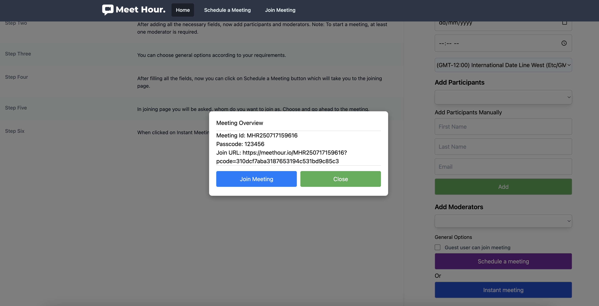

# angular-meethour

Meet Hour Angular SDK

[Meet Hour - HD Quality Video conference solution](https://meethour.io)
Meet Hour is HD Quality Video conference solution with End to End Encrypted and many other features such as lobby mode, Donor box & Click&Pledge Connect for fundraising, Video call recording, Youtube Live Stream etc.

# Features: 

    ✅  Free Unlimited Time Group Video Conference
    ✅  Upto 100 Participants Group Meeting
    ✅  Free Video Conference Recording
    ✅  YouTube Live Stream
    ✅  Raise funds via Click&Pledge Connect & DonorBox
    ✅  Virtual Background
    ✅  Live Pad
    ✅  Screensharing on Desktop & Mobile and many other features.

# Try out one free session -

    1. Website - https://meethour.io
    2. Android - https://bit.ly/2U239ll
    3. iOS - https://apple.co/3k8Rpbn

# MeetHour SDK Implementation - Steps

1. SDK Example Link - https://github.com/v-empower/MeetHour-Web-MobileSDKs/tree/master/Web/PHP/CorePHP
2. API Documentation Link - https://docs.v-empower.com/docs/MeetHour-API/

### Pre-requisites
1. Go to meethour.io and signup for Developer or Higher plan. Currently we offer 28 days free trial.
2. Later go to Developer menu and be ready to use the credentials in this SDK below.

## NPM Package

```
    https://www.npmjs.com/package/angular-meethour
```

## Install

```
    npm install angular-meethour@1.0.2

```

### Steps to run the Example

1. First create a developer account in Meet Hour.
2. Go to the dashboard and then click on developers menu.
3. Later in this source code go to src/constants.ts and enter all the credentials of Meet Hour.
4. Now run two commands `npm install` && `npm start`
5. On Home page Click on Get Access Token
6. Then Try Schedule a Meeting or Instant Meeting -> Click on Join Meeting in the popup.




### Full Instructions - Coming Soon