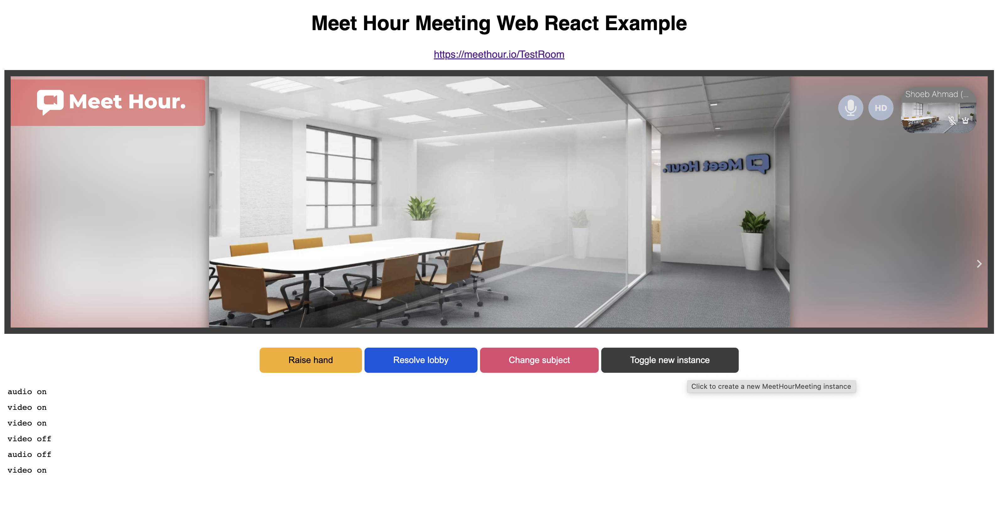

# Meet Hour React Web SDK - Example

React SDK for Meet Hour - (Typescript | Javascript Support)

[Meet Hour - 100% free video conference solution](https://meethour.io)
Meet Hour is 100% free video conference solution with End to End Encrypted and many other features such as lobby mode, Donor box & Click&Pledge Connect for fundraising, Video call recording, Youtube Live Stream etc.

# Features:

    ✅  Free Unlimited Time Group Video Conference
    ✅  Upto 100 Participants Group Meeting
    ✅  Free Video Conference Recording
    ✅  YouTube Live Stream
    ✅  Raise funds via Click&Pledge Connect & DonorBox
    ✅  Virtual Background
    ✅  Live Pad
    ✅  Screensharing on Desktop & Mobile and many other features.

# Try out one free session -

    1. Website - https://meethour.io
    2. Android - https://bit.ly/2U239ll
    3. iOS - https://apple.co/3k8Rpbn


### NPM package (Latest version - 2.0.1)

```
https://www.npmjs.com/package/meet-hour-react-web-sdk

```

### Steps to Use Meet Hour React Web SDK Example

1. Go to meethour.io and signup for Developer or Higher plan. Currently we offer 28 days free trial.
2. Go to the dashboard and then click on developers menu.
3. Copy your Client ID, Client Secret and Api Key. After copying, paste each copied text to the respective constant in the source code src/constants/index.tsx
4. On Home page Click on Get Access Token
5. Then Try Schedule a Meeting & Join Meeting.

## Run Program

```
cd Web/Web-ReactSDK

npm install

npm start

```



### API End Points Supported

1. To Get Access Token Endpoint : => https://docs.v-empower.com/docs/MeetHour-API/a44a7d7669f91-user-login-get-access-token

   ```
       ApiServices.login({
               grant_type, client_id, client_secret, username, password
           });
   ```

   => You have to pass respective values in the argument section. Hence, to get desired response.

2. To schedule a meeting: => https://docs.v-empower.com/docs/MeetHour-API/2de4b757a6312-meeting-schedule-meeting

   ```
       ApiServices. scheduleMeeting(token: string, body: ScheduleMeetingType)

           type ScheduleMeetingType {
                   agenda?: string;
                   attend?:
                       | Array<number>
                       | Array<UserObjectType>
                       | Array<UserObjectType | number>;
                   default_recording_storage?: string;
                   duration_hr?: number;
                   duration_min?: number;
                   enable_pre_registration?: number;
                   endBy?: string;
                   end_date_time?: string;
                   end_times?: number;
                   groups?: Array<number | string>;
                   hostusers?:
                       | Array<number>
                       | Array<UserObjectType>
                       | Array<UserObjectType | number>;
                   instructions?: string;
                   is_recurring?: number;
                   is_show_portal?: number;
                   meeting_agenda?: string;
                   meeting_date: string;
                   meeting_meridiem: string;
                   meeting_name: string;
                   meeting_time: string;
                   meeting_topic?: string;
                   monthlyBy?: string;
                   monthlyByDay?: string;
                   monthlyByWeekday?: string;
                   monthlyByWeekdayIndex?: string;
                   options?: Array<string>;
                   passcode: string;
                   recurring_type?: string;
                   repeat_interval?: number;
                   send_calendar_invite?: number;
                   timezone: string;
                   weeklyWeekDays?: number;
               };


       type UserObjectType {
               email?: string;
               first_name?: string;
               last_name?: string;
           }
   ```

3. To Generate JWT Token Endpoint => https://docs.v-empower.com/docs/MeetHour-API/b7e3d0ab3906f-generate-jwt

   ```
       ApiServices.generateJwt(token: string, body: GenerateJwtType)

      type GenerateJwtType {
               config?: {
               disableDeepLinking?: string;
               dropboxappKey?: string;
               dropboxredirectURI?: string;
               enableClosePage?: string;
               enableWelcomePage?: string;
               fileRecordingsEnabled?: boolean;
               liveStreamingEnabled?: boolean;
               p2penabled?: boolean;
               requireDisplayName?: string;
               resolution?: number;
               startAudioMuted?: number;
               videoheightideal?: number;
               videoheightmax?: number;
               videoheightmin?: number;
               videowidthideal?: number;
               videowidthmax?: number;
               videowidthmin?: number;
               };
               contact_id?: number;
               meeting_id: string;
               ui_config?: {
               ANDROID_APP_PACKAGE?: string;
               APP_NAME?: string;
               APP_SCHEME?: string;
               BRAND_WATERMARK_BACKGROUND?: string;
               DEFAULT_LOGO_URL?: string;
               ENABLE_MOBILE_BROWSER?: string;
               HIDE_DEEP_LINKING_LOGO?: string;
               MEET_HOUR_WATERMARK_LINK?: string;
               MOBILE_APP_PROMO?: string;
               MOBILE_DOWNLOAD_LINK_ANDROID?: string;
               MOBILE_DOWNLOAD_LINK_IOS?: string;
               NATIVE_APP_NAME?: string;
               PROVIDER_NAME?: string;
               SHOW_MEET_HOUR_WATERMARK?: string;
               disablePrejoinFooter?: string;
               disablePrejoinHeader?: string;
               toolbar_buttons?: Array<string>;
               };
           };
   ```

4. To fetch User Details: => https://docs.v-empower.com/docs/MeetHour-API/ff9d0e37d9191-user-details

   ```
       ApiServices.userDetails(token: string)
   ```

5. To fetch access Token using Refresh Token: => https://docs.v-empower.com/docs/MeetHour-API/d851be1af9804-get-access-token-using-refresh-token

   ```
       ApiServices.getRefreshToken(token: string, body: RefreshTokenType)

       type RefreshTokenType {
               client_id: string;
               client_secret: string;
               grant_type: string;
               refresh_token: string;
       }
   ```

6. To add a contact in Meet Hour database: => https://docs.v-empower.com/docs/MeetHour-API/bd1e416413e8c-add-contact

   ```
       ApiServices.addContact(token: string, body: AddContactType)

       type AddContactType {
               country_code?: string;
               email: string;
               firstname: string;
               image?: string;
               is_show_portal?: boolean;
               lastname?: string;
               phone?: string;
           }
   ```

7. To get Timezones of various countries: => https://docs.v-empower.com/docs/MeetHour-API/c688c29bce9b9-timezone-list

   ```
       ApiServices.timezone(token: string)

   ```

8. To get list of all the contacts in your Meet Hour account: => https://api.meethour.io/api/{version}/customer/contacts

   ```
       ApiServices.contactsList(token: string, body: ContactsType)

       type ContactsType {
               exclude_hosts: number;
               limit: number;
               page: number;
           }

   ```

9. To make changes in the existing contact details: => https://docs.v-empower.com/docs/MeetHour-API/28cae9187d215-edit-contact

   ````
    ApiServices.editContact(token: string, body: EditContactType)

    type EditContactType {
            contact_id: number;
            country_code: string;
            email: string;
            firstname: string;
            image: string;
            is_show_portal: boolean;
            lastname: string;
            phone: string;
        }

    ```

   ````

10. To get Upcoming Meetings: => https://docs.v-empower.com/docs/MeetHour-API/31df88388416d-upcoming-meetings

    ```
        ApiServices.upcomingMeetings(token: string, body: {
            limit: number;
            page: number;
        })
    ```

11. To archive a meeting: => https://docs.v-empower.com/docs/MeetHour-API/1dd64523cc6bf-archive-meeting

    ```
        ApiServices.archiveMeeting(
                token: string,
                body: {
                    id?: number;
            })
    ```

12. To get the details of a missed meeting: => https://docs.v-empower.com/docs/MeetHour-API/92998e2dda102-missed-meetings

    ```
        ApiServices.missedMeetings(
            token: string,
            body: {
                limit: number;
                page: number;
            })
    ```

13. To get completed meetings: => https://docs.v-empower.com/docs/MeetHour-API/aa9ef6a678250-completed-meetings

    ```
        ApiServices.completedMeetings(
            token: string,
            body: {
            limit: number;
            page: number;
            })
    ```

14. To edit an existing meeting: => https://docs.v-empower.com/docs/MeetHour-API/5dedde36380b4-meeting-edit-meeting

    ```
        ApiServices.editMeeting(token: string, body: EditMeetingType)

        type EditMeeting {
            agenda?: string;
            attend?:
                | Array<number>
                | Array<UserObjectType>
                | Array<number & UserObjectType>;
            duration_hr?: number;
            duration_min?: number;
            enable_pre_registration?: number;
            endBy?: string;
            end_date_time?: string;
            groups?: Array<number>;
            hostusers?:
                | Array<number>
                | Array<UserObjectType>
                | Array<number & UserObjectType>;
            instructions?: string;
            is_recurring?: number;
            is_show_portal?: number;
            meeting_agenda?: string;
            meeting_date?: string;
            meeting_id: string;
            meeting_meridiem?: string;
            meeting_name?: string;
            meeting_time?: string;
            meeting_topic?: string;
            old_attend?:
                | Array<number>
                | Array<UserObjectType>
                | Array<number & UserObjectType>;
            options?: Array<string>;
            passcode?: string;
            recurring_type?: string;
            repeat_interval?: number;
            timezone?: string;
        }

        type UserObjectType {
            email?: string;
            first_name?: string;
            last_name?: string;
        }
    ```

15. To view a meeting: => https://docs.v-empower.com/docs/MeetHour-API/7e9a0a1e0da7f-meeting-view-meeting

    ```
        ApiServices.viewMeeting(
            token: string,
            body: { meeting_id: string }
            )
    ```

16. To get all the recordings list: => https://docs.v-empower.com/docs/MeetHour-API/ce7c4fd8cae7e-recording-list

    ```
        ApiServices.recordingsList(token: string, body: RecordingsList)

        type RecordingsList {
            filter_by: string;
            limit: number;
            page: number;
        }
    ```

### Modules

This library exposes two components with similar properties, intended for different use-cases.

#### MeetHourMeeting (Join Meeting Component)

To be used with custom domains as-it-is in React projects:

```js
<MeetHourMeeting domain={YOUR_DOMAIN} roomName={YOUR_ROOM_NAME} apiKey={} apiBaseUR={} jwt={} pcode={} />
```

##### Properties specific to the `MeetHourMeeting` component

###### `domain`

Optional. Field used to retrieve the external_api.js file that initializes the IFrame. If omitted, defaults to `meethour.io`.

###### `roomName` (Meeting ID)

Required. String used when joining the meeting.

###### `apiKey` (Meeting ID)

Required. You will get apiKey from Developers page of Meet Hour Dashboard (https://portal.meethour.io).

###### `jwt`

Optional. Pass JWT if Moderator is trying to join the call.

###### `pcode`

Optional. Encrypted passcode of Meet Hour Meeting.

###### `apiBaseURL`

Optional. api.meethour.io as your default value.

###### `getIFrameRef`

Optional. Callback to retrieve the parent node of the IFrame for more control (e.g. styling).

```js
<MeetHourMeeting
    ...
    getIFrameRef = { iframeRef => { iframeRef.style.height = '700px'; } }
/>
```

###### `onApiReady`

Optional. Callback triggered when the external API is loaded to expose it for events and commands.

```js
<MeetHourMeeting
    ...
    onApiReady = { externalApi => console.log('Meet Hour External API', externalApi) }
/>
```

###### `onReadyToClose`

Optional. Callback triggered when the meeting is ready to be closed.

```js
<MeetHourMeeting
    ...
    onReadyToClose = { () => console.log('Meet Hour is ready to be closed') }
/>
```

###### `configOverwrite`

Optional. Object used for options overrides.

###### `interfaceConfigOverwrite`

Optional. Object used for more options overrides.

###### `userInfo`

Optional. Details about the participant that started the meeting.

###### `spinner`

Optional. Custom loading view while the IFrame is loading.

## Example

Install and run the project from the sample SDK from here - https://github.com/v-empower/MeetHour-Web-MobileSDKs/Web/Web-ReactSDK

# MeetHour SDKs Examples & APIs

1. SDK Example Link - https://github.com/v-empower/MeetHour-Web-MobileSDKs
2. API Documentation Link - https://docs.v-empower.com/docs/MeetHour-API/

# Library & SDK

1. Android Maven - https://repo.meethour.io/maven/releases/
2. iOS Cocoapods - https://cocoapods.org/pods/MeetHourSDK
3. React Native NPM - https://www.npmjs.com/package/react-native-meet-hour-sdk
4. Flutter Pub Dev - https://pub.dev/packages/meet_hour

# Known Errors

1. Something went wrong - Make sure you add the credentials in src/constants/index.tsx file.
