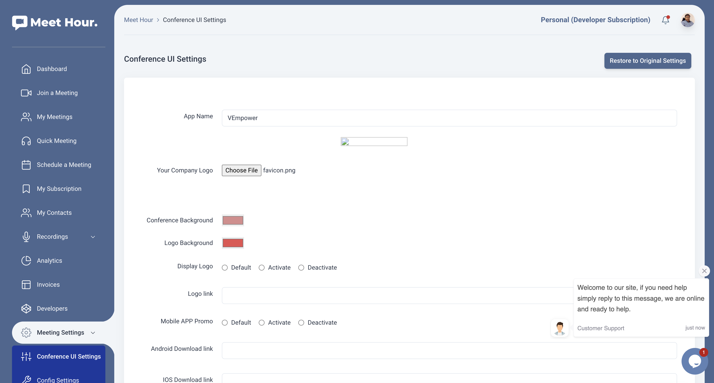

# MeetHour SDK Implementation - Steps

1. SDK Example Link - https://github.com/v-empower/MeetHour-Web-MobileSDKs
2. API Documentation Link - https://docs.v-empower.com/docs/MeetHour-API/

# Steps to Integrate:

1. Signup for Meet Hour (https://meethour.io) and signup for Developer or Higher plan. Currently we offer 28 days free trial.
2. Once you signup for developer plan, and go to our Dashboard - (https://portal.meethour.io) and tap on "Developers" menu.
3. Now copy and Client ID & Client Secret and keep it handy with you.
4. Go to our API documentation and hit Login API to get oAuth Access Token - (https://bit.ly/3E2hKU7)
5. Once you get an access token, you can access any our API. Now you first thing you have to do is create a contact in our system as soon as user signup in your platform using this API (https://bit.ly/3LRehug). This will give you unique contact_id of that user. You require this id when you schedule a meeting below.
6. Later go to Schedule Meeting API -> Pass all the parameters needed to generate a new meetings - (https://bit.ly/3riFLkx)
7. Once the meeting is genereate, in order to join a meeting you require to Generate JWT Token using this API (https://bit.ly/3ur5pFR) and pass it to the conference URL via MT Parameter - https://meethour.io?mt=eyJ0eXAiOiJKV1QiLCJhbGciOiJIUzI1NiIsImFjY2Vzc190b2tlbiI6ImV5SjBlWEFpT2lKS1YxUWlMQ0poYkdjaU9pSlNVekkxTmlKOS5leUpoZFdRaU9pSTVNemxrWmpVeE5pMDJNekEzTFRRNVkyUXRPVGMxTXkwek1XRTNNemRrT1RGaE1HWWlMQ0pxZEdraU9pSmtNMlUyT

### MeetHour Embed Meeting

All the Conference UI is managed from this page - https://portal.meethour.io/customer/ui_settings

You can also try Embed Meeting via below code. Change the Meeting URL in below <iframe>

```
<html>
    <head>
        <meta name="viewport" content="width=device-width, initial-scale=1.0,user-scalable=0">
    </head>
<body>
    <iframe allow="camera; microphone; display-capture; autoplay; clipboard-write" src="https://meethour.io/TestRoom#interfaceConfig.applyMeetingSettings=true" name="mhConferenceFrame0" id="mhConferenceFrame0" allowfullscreen="true" style="height: 800px; width: 100%; border: 0px;" frameborder="0"></iframe>
</body>
</html>
```


  
#### Meet Hour External Javascript API - SDK (Checkout Example.html)

## Installation

To add Meet Hour programmatically, please use our Javascript API library:

## API Documentation - https://docs.v-empower.com/docs/MeetHour-API/ 

## Web SDK

### `api = new MeetHourExternalAPI(domain, options)`

Config & User Interface Settings Parameters - Parameters - https://docs.v-empower.com/docs/MeetHour-API/281f2d9a6c539-generate-jwt

The next step for embedding Meet Hour is to create the Meet Hour API object.
Its constructor gets a number of options:

* **domain**: domain used to build the conference URL, 'meethour.io' for
  example.
* **options**: object with properties - the optional arguments:
    * **roomName**: (required) name of the room to join.
    * **apiKey**: (required). You will get API key from your Developer Page - https://portal.meethour.io/customer/developers. Make sure you are on our Developer or higher plan. - https://meethour.io/#pricing
    * **jwt**: (required - If you to start meeting or join or moderator) - https://docs.v-empower.com/docs/MeetHour-API/b3A6MzcwODk5MTQ-generate-jwt
    * **width**: (optional) width for the iframe which will be created. If a number is specified it's treated as pixel units. If a string is specified the format is number followed by 'px', 'em', 'pt' or '%'.
    * **height**: (optional) height for the iframe which will be created. If a number is specified it's treated as pixel units. If a string is specified the format is number followed by 'px', 'em', 'pt' or '%'.
    * **parentNode**: (optional) HTML DOM Element where the iframe will be added as a child.
    * **noSSL**: (optional, defaults to true) Boolean indicating if the server should be contacted using HTTP or HTTPS.
    * **onload**: (optional) handler for the iframe onload event.
    * **invitees**: (optional) Array of objects containing information about new participants that will be invited in the call.
    * **devices**: (optional) A map containing information about the initial devices that will be used in the call.
    * **userInfo**: (optional) JS object containing information about the participant opening the meeting, such as `email`.


```Javascript Standard Example
<script src='https://api.meethour.io/libs/v2.4.1/external_api.min.js'></script>
<div id="conference" style="height: 100%;"></div>
 <script>
        var domain = "meethour.io";
        var options = {
            roomName: "TestRoom", //Change to your Meeting ID
            parentNode: document.querySelector("#conference"),
            jwt: "",
            apiKey: "",
            interfaceConfigOverwrite: {
                applyMeetingSettings: true, // This is managed from this page - https://portal.meethour.io/customer/ui_settings
                disablePrejoinHeader: true,
                disablePrejoinFooter: true,                
                SHOW_MEET_HOUR_WATERMARK: false,
                HIDE_DEEP_LINKING_LOGO: true,
                MOBILE_APP_PROMO: false,
                ENABLE_MOBILE_BROWSER: true
            },

        };
        // Initialization of MeetHour External API
        var api = new MeetHourExternalAPI(domain, options);

        // Passing room password dynamically.
        var pass = '12345';

        setTimeout(() => {
            api.addEventListener('passwordRequired', () => {
                api.executeCommand('password', pass);
            });

        }, 200);
 </script>
```


Example:

```javascript
const domain = 'meethour.io';
const options = {
    roomName: 'MeetHourExternalAPI',
    width: 700,
    height: 700,
    parentNode: document.querySelector('#meet')
};
const api = new MeetHourExternalAPI(domain, options);
```

You can set the initial media devices for the call:

```javascript
const domain = 'meethour.io';
const options = {
    ...
    devices: {
        audioInput: '<deviceLabel>',
        audioOutput: '<deviceLabel>',
        videoInput: '<deviceLabel>'
    },
    ...
};
const api = new MeetHourExternalAPI(domain, options);
```

You can overwrite options set in [config.js] and [interface_config.js].
For example, to enable the filmstrip-only interface mode, you can use:

```javascript
const options = {
    ...
    interfaceConfigOverwrite: { filmStripOnly: true },
    ...
};
const api = new MeetHourExternalAPI(domain, options);
```

You can also pass a jwt token to Meet Hour:

 ```javascript
const options = {
    ...
    jwt: '<jwt_token>',
    noSsl: false,
    ...
};
const api = new MeetHourExternalAPI(domain, options);
 ```

You can set the userInfo(email, display name) for the call:

```javascript
var domain = "meethour.io";
var options = {
    ...
    userInfo: {
        email: 'email@meethourexamplemail.com',
        displayName: 'John Doe'
    }
}
var api = new MeetHourExternalAPI(domain, options);
```

### Controlling the embedded Meet Hour Conference

Device management `MeetHourExternalAPI` methods:
* **getAvailableDevices** - Retrieve a list of available devices.

```javascript
api.getAvailableDevices().then(devices => {
    devices = {
        audioInput: [{
            deviceId: 'ID'
            groupId: 'grpID'
            kind: 'audioinput'
            label: 'label'
        },....],
        audioOutput: [{
            deviceId: 'ID'
            groupId: 'grpID'
            kind: 'audioOutput'
            label: 'label'
        },....],
        videoInput: [{
            deviceId: 'ID'
            groupId: 'grpID'
            kind: 'videoInput'
            label: 'label'
        },....]
    }
    ...
});
```
* **getCurrentDevices** - Retrieve a list with the devices that are currently selected.

```javascript
api.getCurrentDevices().then(devices => {
    devices = {
        audioInput: {
            deviceId: 'ID'
            groupId: 'grpID'
            kind: 'videoInput'
            label: 'label'
        },
        audioOutput: {
            deviceId: 'ID'
            groupId: 'grpID'
            kind: 'videoInput'
            label: 'label'
        },
        videoInput: {
            deviceId: 'ID'
            groupId: 'grpID'
            kind: 'videoInput'
            label: 'label'
        }
    }
    ...
});
```
* **isDeviceChangeAvailable** - Resolves with true if the device change is available and with false if not.

```javascript
// The accepted deviceType values are - 'output', 'input' or undefined.
api.isDeviceChangeAvailable(deviceType).then(isDeviceChangeAvailable => {
    ...
});
```
* **isDeviceListAvailable** - Resolves with true if the device list is available and with false if not.

```javascript
api.isDeviceListAvailable().then(isDeviceListAvailable => {
    ...
});
```
* **isMultipleAudioInputSupported** - Resolves with true if multiple audio input is supported and with false if not.

```javascript
api.isMultipleAudioInputSupported().then(isMultipleAudioInputSupported => {
    ...
});
```
* **setAudioInputDevice** - Sets the audio input device to the one with the label or id that is passed.

```javascript
api.setAudioInputDevice(deviceLabel, deviceId);
```
* **setAudioOutputDevice** - Sets the audio output device to the one with the label or id that is passed.

```javascript
api.setAudioOutputDevice(deviceLabel, deviceId);
```
* **setVideoInputDevice** - Sets the video input device to the one with the label or id that is passed.

```javascript
api.setVideoInputDevice(deviceLabel, deviceId);
```

You can control the embedded Meet Hour conference using the `MeetHourExternalAPI` object by using `executeCommand`:

```javascript
api.executeCommand(command, ...arguments);
```

The `command` parameter is String object with the name of the command. The following commands are currently supported:

* **displayName** - Sets the display name of the local participant. This command requires one argument - the new display name to be set.
```javascript
api.executeCommand('displayName', 'New Nickname');
```

* **password** - Sets the password for the room. This command requires one argument - the password name to be set.
```javascript
api.executeCommand('password', 'The Password');
```

* **sendTones** - Play touch tones.
```javascript
api.executeCommand('sendTones', {
    tones: string, // The dial pad touch tones to play. For example, '12345#'.
    duration: number, // Optional. The number of milliseconds each tone should play. The default is 200.
    pause: number // Optional. The number of milliseconds between each tone. The default is 200.
});
```

* **subject** - Sets the subject of the conference. This command requires one argument - the new subject to be set.
```javascript
api.executeCommand('subject', 'New Conference Subject');
```

* **toggleAudio** - Mutes / unmutes the audio for the local participant. No arguments are required.
```javascript
api.executeCommand('toggleAudio');
```

* **toggleVideo** - Mutes / unmutes the video for the local participant. No arguments are required.
```javascript
api.executeCommand('toggleVideo');
```

* **toggleFilmStrip** - Hides / shows the filmstrip. No arguments are required.
```javascript
api.executeCommand('toggleFilmStrip');
```

* **toggleChat** - Hides / shows the chat. No arguments are required.
```javascript
api.executeCommand('toggleChat');
```

* **toggleShareScreen** - Starts / stops screen sharing. No arguments are required.
```javascript
api.executeCommand('toggleShareScreen');
```

* **toggleTileView** - Enter / exit tile view layout mode. No arguments are required.
```javascript
api.executeCommand('toggleTileView');
```

* **hangup** - Hangups the call. No arguments are required.
```javascript
api.executeCommand('hangup');
```

* **email** - Changes the local email address. This command requires one argument - the new email address to be set.
```javascript
api.executeCommand('email', 'example@example.com');
```

* **avatarUrl** - Changes the local avatar URL. This command requires one argument - the new avatar URL to be set.
```javascript
api.executeCommand('avatarUrl', 'https://avatars0.githubusercontent.com/u/3671647');
```

* **sendEndpointTextMessage** - Sends a text message to another participant through the datachannels.
```javascript
api.executeCommand('receiverParticipantId', 'text');
```
* **setVideoQuality** - Sets the send and receive video resolution. This command requires one argument - the resolution height to be set.
```javascript
api.executeCommand('setVideoQuality', 720);
```

You can also execute multiple commands using the `executeCommands` method:
```javascript
api.executeCommands(commands);
```
The `commands` parameter is an object with the names of the commands as keys and the arguments for the commands as values:
```javascript
api.executeCommands({
    displayName: [ 'nickname' ],
    toggleAudio: []
});
```

You can add event listeners to the embedded Meet Hour using the `addEventListener` method.
**NOTE: This method still exists but it is deprecated. MeetHourExternalAPI class extends [EventEmitter]. Use [EventEmitter] methods (`addListener` or `on`).**
```javascript
api.addEventListener(event, listener);
```

The `event` parameter is a String object with the name of the event.
The `listener` parameter is a Function object with one argument that will be notified when the event occurs with data related to the event.

The following events are currently supported:
* **cameraError** - event notifications about meethour-Meet having failed to access the camera. The listener will receive an object with the following structure:
```javascript
{
    type: string, // A constant representing the overall type of the error.
    message: string // Additional information about the error.
}
```

* **avatarChanged** - event notifications about avatar
changes. The listener will receive an object with the following structure:
```javascript
{
    id: string, // the id of the participant that changed his avatar.
    avatarURL: string // the new avatar URL.
}
```

* **audioAvailabilityChanged** - event notifications about audio availability status changes. The listener will receive an object with the following structure:
```javascript
{
    available: boolean // new available status - boolean
}
```

* **audioMuteStatusChanged** - event notifications about audio mute status changes. The listener will receive an object with the following structure:
```javascript
{
    muted: boolean // new muted status - boolean
}
```

* **endpointTextMessageReceived** - event notifications about a text message received through datachannels.
The listener will receive an object with the following structure:
```javascript
{
    senderInfo: {
        jid: string, // the jid of the sender
        id: string // the participant id of the sender
    },
    eventData: {
        name: string // the name of the datachannel event: `endpoint-text-message`
        text: string // the received text from the sender
    }
}
```

* **micError** - event notifications about meethour-Meet having failed to access the mic. The listener will receive an object with the following structure:
```javascript
{
    type: string, // A constant representing the overall type of the error.
    message: string // Additional information about the error.
}
```

* **screenSharingStatusChanged** - receives event notifications about turning on/off the local user screen sharing. The listener will receive object with the following structure:
```javascript
{
    on: boolean, //whether screen sharing is on
    details: {

        // From where the screen sharing is capturing, if known. Values which are
        // passed include 'window', 'screen', 'proxy', 'device'. The value undefined
        // will be passed if the source type is unknown or screen share is off.
        sourceType: string|undefined
    }
}
```

* **dominantSpeakerChanged** - receives event notifications about change in the dominant speaker. The listener will receive object with the following structure:
```javascript
{
    id: string //participantId of the new dominant speaker
}
```

* **tileViewChanged** - event notifications about tile view layout mode being entered or exited. The listener will receive object with the following structure:
```javascript
{
    enabled: boolean, // whether tile view is not displayed or not
}
```

* **incomingMessage** - Event notifications about incoming
messages. The listener will receive an object with the following structure:
```javascript
{
    from: string, // The id of the user that sent the message
    nick: string, // the nickname of the user that sent the message
    message: string // the text of the message
}
```

* **outgoingMessage** - Event notifications about outgoing
messages. The listener will receive an object with the following structure:
```javascript
{
    message: string // the text of the message
}
```

* **displayNameChange** - event notifications about display name
changes. The listener will receive an object with the following structure:
```javascript
{
    id: string, // the id of the participant that changed his display name
    displayname: string // the new display name
}
```

* **deviceListChanged** - event notifications about device list changes. The listener will receive an object with the following structure:
```javascript
{
    devices: Object // the new list of available devices.
}
```
NOTE: The devices object has the same format as the getAvailableDevices result format.

* **emailChange** - event notifications about email
changes. The listener will receive an object with the following structure:
```javascript
{
    id: string, // the id of the participant that changed his email
    email: string // the new email
}
```
* **feedbackSubmitted** - event notifications about conference feedback submission
```javascript
{
    error: string // The error which occurred during submission, if any.
}
```

* **filmstripDisplayChanged** - event notifications about the visibility of the filmstrip being updated.
```javascript
{
    visible: boolean // Whether or not the filmstrip is displayed or hidden.
}
```

* **participantJoined** - event notifications about new participants who join the room. The listener will receive an object with the following structure:
```javascript
{
    id: string, // the id of the participant
    displayName: string // the display name of the participant
}
```

* **participantKickedOut** - event notifications about a participants being removed from the room. The listener will receive an object with the following structure:
```javascript
{
    kicked: {
        id: string, // the id of the participant removed from the room
        local: boolean // whether or not the participant is the local particiapnt
    },
    kicker: {
        id: string // the id of the participant who kicked out the other participant
    }
}
```

* **participantLeft** - event notifications about participants that leave the room. The listener will receive an object with the following structure:
```javascript
{
    id: string // the id of the participant
}
```

* **participantRoleChanged** - event notification fired when the role of the local user has changed (none, moderator, participant). The listener will receive an object with the following structure:
```javascript
{
    id: string // the id of the participant
    role: string // the new role of the participant
}
```

* **passwordRequired** - event notifications fired when failing to join a room because it has a password.


* **videoConferenceJoined** - event notifications fired when the local user has joined the video conference. The listener will receive an object with the following structure:
```javascript
{
    roomName: string, // the room name of the conference
    id: string, // the id of the local participant
    displayName: string, // the display name of the local participant
    avatarURL: string // the avatar URL of the local participant
}
```

* **videoConferenceLeft** - event notifications fired when the local user has left the video conference. The listener will receive an object with the following structure:
```javascript
{
    roomName: string // the room name of the conference
}
```

* **videoAvailabilityChanged** - event notifications about video availability status changes. The listener will receive an object with the following structure:
```javascript
{
    available: boolean // new available status - boolean
}
```

* **videoMuteStatusChanged** - event notifications about video mute status changes. The listener will receive an object with the following structure:
```javascript
{
    muted: boolean // new muted status - boolean
}
```

* **readyToClose** - event notification fired when Meet Hour is ready to be closed (hangup operations are completed).

* **subjectChange** - event notifications about subject of conference changes.
The listener will receive an object with the following structure:
```javascript
{
    subject: string // the new subject
}
```

* **suspendDetected** - event notifications about detecting suspend event in host computer.

You can also add multiple event listeners by using `addEventListeners`.
This method requires one argument of type Object. The object argument must
have the names of the events as keys and the listeners of the events as values.
**NOTE: This method still exists but it is deprecated. MeetHourExternalAPI class extends [EventEmitter]. Use [EventEmitter] methods.**

```javascript
function incomingMessageListener(object)
{
// ...
}

function outgoingMessageListener(object)
{
// ...
}

api.addEventListeners({
    incomingMessage: incomingMessageListener,
    outgoingMessage: outgoingMessageListener
});
```

If you want to remove a listener you can use `removeEventListener` method with argument the name of the event.
**NOTE: This method still exists but it is deprecated. MeetHourExternalAPI class extends [EventEmitter]. Use [EventEmitter] methods( `removeListener`).**
```javascript
api.removeEventListener('incomingMessage');
```

If you want to remove more than one event you can use `removeEventListeners` method with an Array with the names of the events as an argument.
**NOTE: This method still exists but it is deprecated. MeetHourExternalAPI class extends [EventEmitter]. Use [EventEmitter] methods.**
```javascript
api.removeEventListeners([ 'incomingMessage', 'outgoingMessageListener' ]);
```

You can get the number of participants in the conference with the following API function:
```javascript
const numberOfParticipants = api.getNumberOfParticipants();
```

You can get the avatar URL of a participant in the conference with the following API function:
```javascript
const avatarURL = api.getAvatarURL(participantId);
```

You can get the display name of a participant in the conference with the following API function:
```javascript
const displayName = api.getDisplayName(participantId);
```

You can get the email of a participant in the conference with the following API function:
```javascript
const email = api.getEmail(participantId);
```

You can get the iframe HTML element where Meet Hour is loaded with the following API function:
```javascript
const iframe = api.getIFrame();
```

You can check whether the audio is muted with the following API function:
```javascript
api.isAudioMuted().then(muted => {
    ...
});
```

You can check whether the video is muted with the following API function:
```javascript
api.isVideoMuted().then(muted => {
    ...
});
```

You can check whether the audio is available with the following API function:
```javascript
api.isAudioAvailable().then(available => {
    ...
});
```

You can check whether the video is available with the following API function:
```javascript
api.isVideoAvailable().then(available => {
    ...
});
```

You can invite new participants to the call with the following API function:
```javascript
api.invite([ {...}, {...}, {...} ]).then(() => {
    // success
}).catch(() => {
    // failure
});
```
**NOTE: The format of the invitees in the array depends on the invite service used for the deployment.**

You can remove the embedded Meet Hour Conference with the following API function:
```javascript
api.dispose();
```

